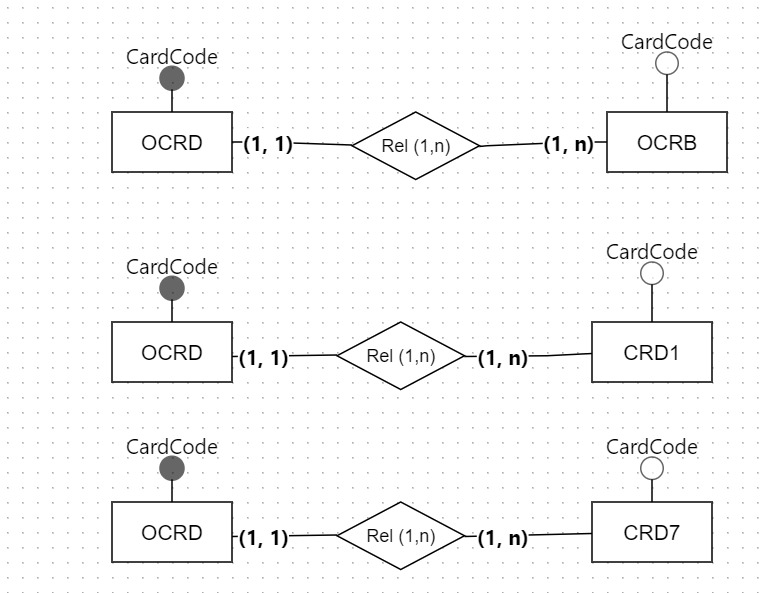
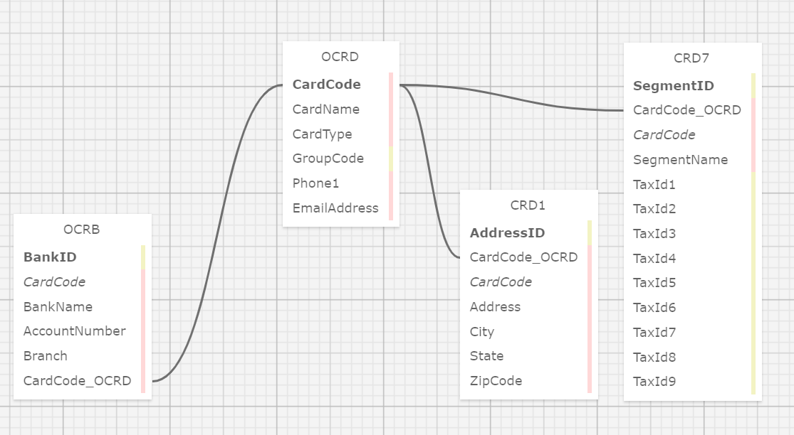

# Modelo de Dados Mestres SAP B1 - Estoque

## 1. Modelo Conceitual
O **Modelo Conceitual** é uma representação gráfica das entidades envolvidas em um sistema de gerenciamento de dados. Ele descreve as entidades principais e suas relações, sem se preocupar com detalhes de implementação, como os tipos de dados. O objetivo é fornecer uma visão de alto nível do sistema.

### Imagem do modelo conceitual:

Figura 1 - Modelo Conceitual 
 
Fonte: Material produzido pelo grupo de Estoque (2024)

No diagrama acima, as principais entidades estão conectadas por seus relacionamentos. A entidade **OCRD** representa os dados mestres de clientes e fornecedores. Ela se relaciona diretamente com três outras entidades: **OCRB**, **CRD1**, e **CRD7**, todas ligadas através do campo **CardCode**, o identificador único de cada cliente ou fornecedor.

A entidade **OCRB** armazena informações bancárias dos clientes e fornecedores, enquanto **CRD1** mantém os endereços e **CRD7** guarda informações relacionadas a segmentos de mercado, incluindo identificadores fiscais.

## 2. Modelo Lógico
O **Modelo Lógico** é a etapa subsequente do modelo conceitual. Ele detalha como as entidades e seus atributos serão armazenados no banco de dados, definindo tipos de dados, chaves primárias e estrangeiras, e as relações entre as tabelas. Esse modelo oferece uma visão mais técnica e está mais próximo da implementação.

### Imagem do modelo lógico:

Figura 2 - Modelo Lógico 
 
Fonte: Material produzido pela autora (2024)

Neste modelo, vemos a mesma estrutura de entidades do modelo conceitual, porém com uma descrição detalhada dos atributos de cada uma. Por exemplo, a entidade **OCRD** contém atributos como **CardName**, **CardType**, **Phone1**, e **EmailAddress**. A entidade **OCRB** inclui campos específicos de banco, como **BankName** e **AccountNumber**, enquanto **CRD1** detalha endereços, e **CRD7** guarda informações fiscais.

Para acessar a versão `SQL` do modelo lógico criado, acessar [esse link](../src/codigo.sql).
Para acessar a versão `XML` do modelo lógico criado, acessar [esse link](../src/codigo.xml).